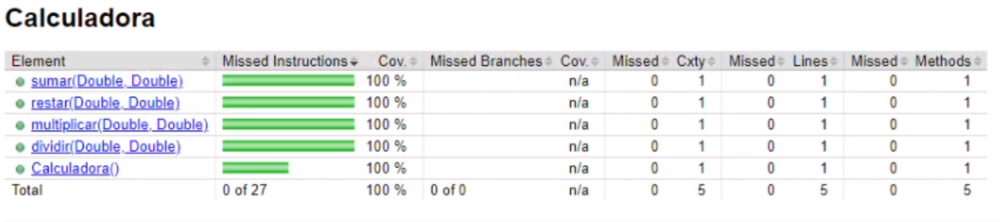
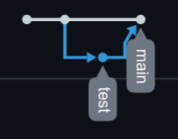
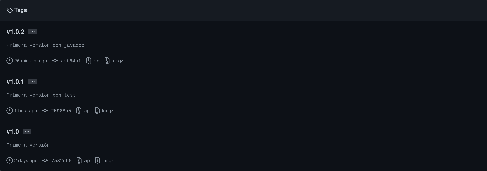

# Practica5

#### Realizada por:  
Samuele Tonarini  
Erik Pardillo Chamorro  

[Repositorio GitHub](https://github.com/ErikPC/Practica5)

## Instrucciones:
- Crea un nuevo proyecto en github, por nombre Practica5.
- Crea la interfaz ICalculadora con las operaciones sumar, restar multiplicar y dividir.
- Crea la clase calculadora que utilice la interfaz anterior e implementa los métodos.
- Realiza el primer commit a github.
- Luego, crea los test unitarios en JUnit de estos cuatro métodos.
- Realiza el segundo commit.
- Realiza diferentes pruebas para validar que los test funcionan y expón los resultados obtenidos, % de tests pasados etc.  

## Realizacion Practica
Aqui podemos ver la interfaz ICalculadora con los metodos sumar, restar, multiplicar y dividir; Todos aceptan dos *Double*s y devuelven un *double*.
```java
package edu.poniperro.intefaces;

public interface ICalculadora {
    double sumar(Double primerNum, Double segundoNum);

    double restar(Double primerNum, Double segundoNum);

    double multiplicar(Double primerNum, Double segundoNum);

    double dividir(Double primerNum, Double segundoNum);
}
```  

Despues hemos creado la clase Calculadora implementando la interfaz ICalculadora.
```java
package edu.poniperro;

import edu.poniperro.intefaces.ICalculadora;

public class Calculadora implements ICalculadora {

    @Override
    public double sumar(Double primerNum, Double segundoNum) {
        return primerNum + segundoNum;
    }

    @Override
    public double restar(Double primerNum, Double segundoNum) {
        return primerNum - segundoNum;
    }

    @Override
    public double multiplicar(Double primerNum, Double segundoNum) {
        return primerNum * segundoNum;
    }

    @Override
    public double dividir(Double primerNum, Double segundoNum) {
        return primerNum / segundoNum;
    }

}
```
### Tests
Por ultimo hemos implementado unos tests para comprobar la clase calculadora; Uno comprobando numeros positivos, unos comprobando numeros negativos, y por ultimo comprobando la division por 0.
```java
package edu.poniperro;

import static org.junit.Assert.assertEquals;
import static org.junit.Assert.assertTrue;

import org.junit.Test;

public class AppTest {
    Calculadora calculadora = new Calculadora();

    @Test
    public void firstTest() {
        assertTrue(true);
    }

    @Test
    public void testSuma() {
        assertEquals(10, calculadora.sumar(5.0, 5.0), 0);
    }

    @Test
    public void testResta() {
        assertEquals(0, calculadora.restar(5.0, 5.0), 0);
    }

    @Test
    public void testMultiplicar() {
        assertEquals(25, calculadora.multiplicar(5.0, 5.0), 0);
    }

    @Test
    public void testDividir() {
        assertEquals(1, calculadora.dividir(5.0, 5.0), 0);
    }

    @Test
    public void testSumaNegativa() {
        assertEquals(0, calculadora.sumar(-5.0, 5.0), 0);
    }

    @Test
    public void testRestaNegativa() {
        assertEquals(-5, calculadora.restar(0.0, 5.0), 0);
    }

    @Test
    public void testMultiplicarNegativa() {
        assertEquals(-25, calculadora.multiplicar(5.0, -5.0), 0);
    }

    @Test
    public void testDividirNegativo() {
        assertEquals(-1, calculadora.dividir(5.0, -5.0), 0);
    }

    @Test
    public void testDividirZero() {
        assertEquals(Double.POSITIVE_INFINITY, calculadora.dividir(5.0, 0.0), 0);

    }
}
```
Como coverage hemos obtenido el 100%:  
  

### Versionado
Aqui podemos ver nuestro workflow de branches:  
  

Y aqui podemos ver nuestro versionado semantico:  
  
